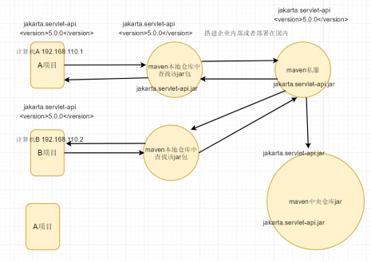

* [Maven 基础入门]()
    * [一、maven基本概述](#%E4%B8%80maven%E5%9F%BA%E6%9C%AC%E6%A6%82%E8%BF%B0)
      * [1.1 为什么要使用maven](#11-%E4%B8%BA%E4%BB%80%E4%B9%88%E8%A6%81%E4%BD%BF%E7%94%A8maven)
      * [1.2 maven的概述](#12-maven%E7%9A%84%E6%A6%82%E8%BF%B0)
      * [1.3 maven的项目结构](#13-maven%E7%9A%84%E9%A1%B9%E7%9B%AE%E7%BB%93%E6%9E%84)
    * [二、maven下载jar包原理](#%E4%BA%8Cmaven%E4%B8%8B%E8%BD%BDjar%E5%8C%85%E5%8E%9F%E7%90%86)
      * [2.1 仓库及分类](#21-%E4%BB%93%E5%BA%93%E5%8F%8A%E5%88%86%E7%B1%BB)
      * [2.2 下载jar包原理](#22-%E4%B8%8B%E8%BD%BDjar%E5%8C%85%E5%8E%9F%E7%90%86)
    * [三、maven环境的安装](#%E4%B8%89maven%E7%8E%AF%E5%A2%83%E7%9A%84%E5%AE%89%E8%A3%85)
    * [四、简单构建maven项目](#%E5%9B%9B%E7%AE%80%E5%8D%95%E6%9E%84%E5%BB%BAmaven%E9%A1%B9%E7%9B%AE)
      * [4.1 maven常用命令](#41-maven%E5%B8%B8%E7%94%A8%E5%91%BD%E4%BB%A4)
      * [4.2 maven项目标准目录结构](#42-maven%E9%A1%B9%E7%9B%AE%E6%A0%87%E5%87%86%E7%9B%AE%E5%BD%95%E7%BB%93%E6%9E%84)
    * [五、maven仓库配置](#%E4%BA%94maven%E4%BB%93%E5%BA%93%E9%85%8D%E7%BD%AE)
      * [5.1 配置本地仓库](#51-%E9%85%8D%E7%BD%AE%E6%9C%AC%E5%9C%B0%E4%BB%93%E5%BA%93)
      * [5.2 配置maven私服仓库](#52-%E9%85%8D%E7%BD%AEmaven%E7%A7%81%E6%9C%8D%E4%BB%93%E5%BA%93)
    * [六、maven配置详解](#%E5%85%ADmaven%E9%85%8D%E7%BD%AE%E8%AF%A6%E8%A7%A3)
    * [七、maven依赖范围](#%E4%B8%83maven%E4%BE%9D%E8%B5%96%E8%8C%83%E5%9B%B4)

# Maven 基础入门

### 一、maven基本概述

#### 1.1 为什么要使用maven
> 使用maven来统一管理项目中的jar包  

#### 1.2 maven的概述  

Maven就是一款帮助程序员构建项目的工具，我们只需要告诉Maven需要哪些Jar 包，它会帮助我们下载所有的Jar，极大提升开发效率

> **1.清理**，把之前项目编译的东西删除掉，为新的编译代码做准备。  
> **2.编译**，把程序源代码编译为执行代码，java-class文件 
批量的，maven可以同时把成千上百的文件编译为class
javac不一样，javac一次编译一个文件。  
> **3.测试**：maven可以执行测试程序代码，验证你的功能是都正确。
批量的，maven可以同时执行多个测试代码，同时测试很多功能。  
> **4.报告**，生成的测试结果的文件，测试通过没有。  
> **5.打包**，把你的项目中所有的class文件，配置文件等所有资源放到一个压缩文件中。
这个压缩文件就是项目的结果文件，通常java程序压缩文件是jar扩展名的。对于web应用， 压缩文件扩展名是.war。  
> **6.安装**，把5中生成的文件jar，war安装到本地仓库  
> **7.部署**，把程序安装好可以执行  

#### 1.3 maven的项目结构 
Maven规定的统一的目录结构
> maven项目标准目录结构：  
>
>  &ensp;&ensp;maven的java工程：  
>  &emsp;&emsp;src/main/java目录  核心代码部分  
>  &emsp;&emsp;ssrc/main/resources  配置文件部分  
>  &emsp;&emsp;ssrc/test/java目录  测试代码部分  
>  &emsp;&emsp;ssrc/test/resources  测试配置文件  
>
>  &ensp;&ensp;maven的web工程：  
>  &emsp;&emsp;ssrc/main/webapp 页面资源，js，css，图片等等

### 二、maven下载jar包原理

#### 2.1 仓库及分类
> 仓库，缓存我们的jar包  
> 使用maven统一管理维护我们项目中所有的jar包
> * 1. 本地仓库 (当前计算机电脑自己   安装maven环境  缓存jar包)
> * 2. 私服仓库
> * 3. 远程仓库(中央仓库)

#### 2.2 下载jar包原理
> 1.  当前我们的项目会引入jar包，先去maven本地仓库
中查找该jar包，如果maven本地仓库中有该jar包则直接
使用maven本地仓库中的jar包。
> 
>2. 如果maven本地仓库中没有该jar包，则会maven中央仓库
中下载该jar包 在缓存到我们maven本地仓库中。
>
> 3. 如果去maven中央仓库下载jar包 速度可能会非常慢  
> maven本地仓库 → maven私服 → maven中央仓库

**注意：  
本地仓库适合于： 在同一台计算机电脑上 多个不同的项目 共享同一个本地仓库  
maven私服适合于 多个不同的开发 共享使用同一个maven私服仓库**




### 三、maven环境的安装

第一步：下载Maven的安装包(https://maven.apache.org/download.cgi)  
当前最新版本：[apache-maven-3.8.7-bin.zip](https://dlcdn.apache.org/maven/maven-3/3.8.7/binaries/apache-maven-3.8.7-bin.zip)

第二步：  解压apache-maven-3.8.7-bin.zip这个文件

第三步：进入我的电脑-->右击属性-->高级设置-->点击环境变量
 添加MAVEN_HOME的变量名 为 maven安装路径
 MAVEN_HOME=D:\path\maven\apache-maven-3.2.5

 第四步：进入Path，添加%MAVEN_HOME%\bin  

 第五步：检查自己的maven是否配置成功
 按下win+r 并输入cmd 进入命令行模式。
 在命令行模式输入 mvn -version；  
**注意：最好用管理员身份执行**


### 四、简单构建maven项目

#### 4.1 maven常用命令

|命令|描述|
|---|---|
|mvn clean|对项目进行清理，删除target目录下编译的内容|
|mvn compile|编译项目源代码|
|mvn test|对项目进行运行测试|
|mvn package|打包文件并存放到项目的target目录下，打包好的文件通常都是编译后的class文件|
|mvn install|在本地仓库生成仓库的安装包，可供其他项目引用，同时打包后的文件放到项目的target目录下|

#### 4.2 maven项目标准目录结构
 
> defu-web  
> &nbsp;&nbsp;src  
> &ensp;&ensp;&ensp;&ensp;main---- 主项目  
> &emsp;&emsp;&emsp;&emsp;java-------java代码  
> &emsp;&emsp;&emsp;&emsp;resources  
> &ensp;&ensp;&ensp;&ensp;test  
> &emsp;&emsp;&emsp;&emsp;java-------测试java代码  
> &emsp;&emsp;&emsp;&emsp;resources  
> &nbsp;&nbsp;pom.xml -----核心 例如 当前项目依赖的jar包  

\
**pom.xml示例：**
```maven
<?xml version="1.0" encoding="UTF-8"?>
<project xmlns="http://maven.apache.org/POM/4.0.0"
         xmlns:xsi="http://www.w3.org/2001/XMLSchema-instance"
         xsi:schemaLocation="http://maven.apache.org/POM/4.0.0 http://maven.apache.org/xsd/maven-4.0.0.xsd">
    <modelVersion>4.0.0</modelVersion>

    <groupId>com.defu</groupId>
    <artifactId>defu-web</artifactId>
    <version>1.0-SNAPSHOT</version>

    <dependencies>
        <!--servlet 自动去远程仓库下载jar ，在缓存到本地仓库中-->
        <dependency>
            <groupId>jakarta.servlet</groupId>
            <artifactId>jakarta.servlet-api</artifactId>
            <version>5.0.0</version>
        </dependency>
    </dependencies>

</project>
```


### 五、maven仓库配置

#### 5.1 配置本地仓库
> 1.maven安装目录：D:\path\maven\apache-maven-3.2.5  
> 2.配置settings.xml  
> 3.配置的本地仓库为 ```<localRepository>D:\maven\mvnRespo</localRepository>```
```xml
<dependencies>
        <!--servlet 自动去远程仓库下载jar ，在缓存到本地仓库中-->
        <dependency>
            <groupId>jakarta.servlet</groupId>
            <artifactId>jakarta.servlet-api</artifactId>
            <version>5.0.0</version>
        </dependency>
    </dependencies>
```
#### 5.2 配置maven私服仓库
> 1.maven安装目录：D:\path\maven\apache-maven-3.2.5  
> 2.配置settings.xml  
> 3.配置的私服仓库为国内阿里云私库
```xml
<mirrors>
    <!-- mirror
     | Specifies a repository mirror site to use instead of a given repository. The repository that
     | this mirror serves has an ID that matches the mirrorOf element of this mirror. IDs are used
     | for inheritance and direct lookup purposes, and must be unique across the set of mirrors.
     |
    <mirror>
      <id>mirrorId</id>
      <mirrorOf>repositoryId</mirrorOf>
      <name>Human Readable Name for this Mirror.</name>
      <url>http://my.repository.com/repo/path</url>
    </mirror>
     -->
	 
	 <mirror>
          <id>nexus-aliyun</id>
          <mirrorOf>central</mirrorOf>
          <name>Nexus aliyun</name>
          <url>http://maven.aliyun.com/nexus/content/groups/public</url> 
      </mirror>
	 
  </mirrors>
```

### 六、maven配置详解
> 1.在Maven中坐标就是为了定位一个唯一确定的jar包,  
> 2.使用Maven中坐标定义项目jar的依赖  
> maven坐标的构成
> groupId：定义当前Maven组织名称 例如 com.defu  com.()  
> artifactId：定义实际项目名称    defu-web  
> version：定义当前项目的当前版本   1.0  

```xml
<groupId>com.defu</groupId>
    <artifactId>defu-maven-web</artifactId>
    <version>1.0-SNAPSHOT</version>
```
```xml
 <!--mysql驱动-->
        <dependency>
            <groupId>mysql</groupId>
            <artifactId>mysql-connector-java</artifactId>
            <version>5.1.37</version>
        </dependency>
```

### 七、maven依赖范围
> compile：默认的scope，运行期有效，需要打入包中  
> provided：编译期有效，运行期不需要提供，不会打入包中  
> runtime：编译不需要，在运行期有效，需要导入包中。（接口与实现分离）  
> test：测试需要，不会打入包中  
> system：非本地仓库引入、存在系统的某个路径下的jar。（一般不使用）  